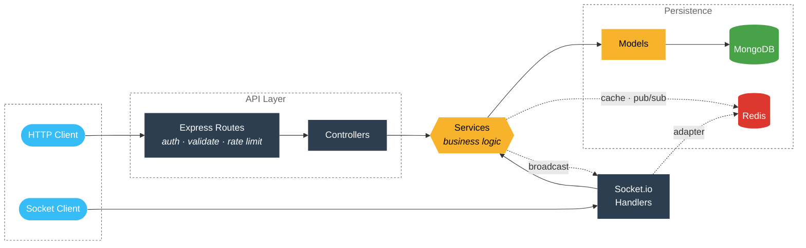

<div align="center">

# RealTime Chat API
> A production-grade chat backend built with Node.js, Express, Socket.io, MongoDB, and Redis. Ships with JWT auth, real-time messaging, file uploads, search, notifications, and full observability.

[](https://git.io/typing-svg)

[](https://skillicons.dev)

</div>

## Why This Exists

Most chat tutorials stop at "send a message." Real apps need **auth with session invalidation**, **presence across multiple devices**, **real-time read receipts**, **file uploads that don't disappear on redeploy**, and **CORS/cookie handling that actually works in production**.

This is the backend I'd want to inherit at a job. Every design decision is deliberate, every failure mode is handled, and the whole thing deploys to free-tier infra in under 30 minutes.

---

## What's Inside

**Auth**
- JWT access tokens (15 min) + refresh tokens (7 days) with **rotation and reuse detection**
- Refresh tokens stored as HttpOnly cookies with `SameSite` + `Secure` in production
- Bcrypt password hashing (12 rounds)
- Account lockout after 5 failed logins
- Password change **invalidates all active sessions**
- Email-based password reset (SHA-256 hashed tokens, never stored raw)

**Real-Time**
- Socket.io with JWT handshake auth
- **Multi-device presence** — one user, N sockets, accurate online/offline
- Typing indicators with auto-expiry
- Live read receipts and delivery status
- Multi-instance scale-out via `@socket.io/redis-adapter`

**Messaging**
- Text, attachments, replies, forwards, edits (15-min window), delete-for-me, delete-for-everyone
- Emoji reactions with one-per-user semantics
- Star and pin messages
- Cursor-paginated history
- Full-text search scoped to the caller's conversations
- Tombstones — deleted messages persist as "This message was deleted"

**Conversations**
- Idempotent DMs (unique sparse index on `privateKey`)
- Group chats with roles (`owner` / `admin` / `member`), add/remove, promote/demote
- Per-user flags: pinned, archived, muted, deleted-for-me
- Unread count denormalized on the participant entry

**Files**
- Provider-agnostic: local disk or Cloudinary
- MIME + extension allowlist (both, not either)
- `sharp` thumbnails for images
- Ownership-enforced deletion via `publicId` prefix

**Notifications**
- Fan-out with per-user preference filtering
- 60-second deduplication window
- TTL index auto-purges after 30 days
- Delivered via sockets in real time

**Ops**
- Winston with daily rotation
- Rate limiting (Redis-backed when available, in-memory fallback)
- Health check that pings Mongo + Redis
- Graceful shutdown on SIGTERM/SIGINT
- Docker + docker-compose
- Swagger UI at `/api/docs`

---

## Stack

| Layer | Tech |
|---|---|
| Runtime | Node.js 18+ |
| Framework | Express 4 |
| Real-time | Socket.io 4 (+ Redis adapter) |
| Database | MongoDB 7 + Mongoose 7 |
| Cache/PubSub | Redis 7 (ioredis) |
| Auth | JWT (HS256) + bcryptjs |
| Validation | Joi |
| Logging | Winston + daily rotate |
| Uploads | Multer + sharp + Cloudinary |
| Docs | OpenAPI 3 via swagger-jsdoc |
| Tests | Jest + Supertest + mongodb-memory-server |

---

## Quick Start

```bash
git clone https://github.com/UttamSingh809/realtime-chat-api
cd realtime-chat-api
npm install
cp .env.example .env
```

Generate two JWT secrets (each ≥ 32 chars, must differ):

```bash
node -e "console.log(require('crypto').randomBytes(48).toString('hex'))"  # run twice
```

Paste them into `.env`, then:

```bash
# Mongo (Docker example)
docker run -d --name mongo-dev -p 27017:27017 mongo:7

# Redis is optional in dev
# docker run -d --name redis-dev -p 6379:6379 redis:7-alpine

npm run dev
```

```
🚀 Server running on port 5000 [development]
📡 API:    http://localhost:5000/api
❤️  Health: http://localhost:5000/api/health
📚 Docs:   http://localhost:5000/api/docs   (if SWAGGER_ENABLED=true)
```

---

## Architecture



**Layers:**

- **Routes** — declare endpoints, chain middleware
- **Controllers** — translate HTTP ↔ service calls (thin, no logic)
- **Services** — business logic, framework-agnostic, called by both REST and sockets
- **Models** — Mongoose schemas with validation, indexing, methods, statics
- **Sockets** — real-time layer; delegates to services before broadcasting
- **Redis** — cross-cutting. Used by services for caching and pub/sub, and by Socket.io for the multi-instance adapter.

**Data Flow**

- **HTTP path** - Client → Routes → Middleware → Controllers → Services → Models → MongoDB
- **WebSocket path** - Client → Socket.io → Socket Handlers → Services → Models → MongoDB
- **Broadcasts** - Services → Socket.io → Client (targeted to rooms; sockets never fetch — they only push)

---

## Project Layout

```
src/
├── config/          database, redis, logger, cloudinary, storage, constants, socket
├── models/          User, RefreshToken, Conversation, Message, Notification
├── services/        auth, user, conversation, message, notification, file, email
├── controllers/     thin HTTP layer
├── routes/          express routers with JSDoc → Swagger
├── middleware/      auth, validate, rateLimiter, upload
├── sockets/         index, auth, presence, broadcast, events/
├── utils/           helpers, validators, exceptions, constants
├── docs/            swagger spec
├── app.js           express app
└── server.js        entry point
```

---

## API Surface

Full reference at `/api/docs` when Swagger is enabled.

### Auth — `/api/auth`
`register` · `login` · `refresh` · `logout` · `logout-all` · `forgot-password` · `reset-password` · `change-password` · `me`

### Users — `/api/users`
`me` · `me/settings` · `me/status` · `search` · `online` · `blocked` · `muted` · `:id` · `:id/block` · `:id/mute`

### Conversations — `/api/conversations`
CRUD · `:id/members` · `:id/members/:userId/role` · `:id/pin` · `:id/archive` · `:id/mute` · `:id/read`

### Messages — `/api/messages`
`send` · `:conversationId` (history) · `message/:id` · `:id` (edit/delete) · `:id/reaction` · `:id/star` · `:id/pin` · `:id/read` · `:id/deliver` · `forward` · `search`

### Files — `/api/files`
`config` · `upload` · `upload-multiple` · `*` (delete)

### Notifications — `/api/notifications`
`list` · `unread-count` · `read-all` · `:id/read` · `:id`

### Health
`GET /api/health` — returns `200` (healthy) or `503` (degraded) with dependency latency

---

## WebSocket Events

```js
const socket = io('http://localhost:5000', {
  auth: { token: accessToken },
  transports: ['websocket'],
});
```

**Client → Server:** `ping` · `user:status` · `conversation:join` · `conversation:leave` · `typing:start` · `typing:stop` · `message:read`

**Server → Client:** `connected` · `message:new` · `message:edited` · `message:deleted` · `message:reaction` · `message:read` · `message:delivered` · `typing:start` · `typing:stop` · `user:status` · `online:users` · `conversation:new` · `conversation:updated` · `notification:new` · `error`

---

## Design Decisions Worth Talking About

**Refresh token rotation with reuse detection.** Every refresh issues a new token and revokes the old one. If a revoked token is ever presented again, we assume it was stolen and revoke **all** of the user's sessions. This turns token theft from a silent compromise into a loud, contained event.

**Unique sparse index on `privateKey`.** DMs are keyed by `smallerUserId:largerUserId`. This makes DM creation idempotent — no race condition can create two DMs between the same two users, even under concurrent requests.

**Tombstones instead of hard deletes.** `softDeleteForEveryone` blanks the content but keeps the row. The message still occupies its slot in the conversation, rendered as "This message was deleted." Search explicitly excludes tombstones so text queries don't match empty strings.

**Delivered vs. read as separate arrays.** `deliveredTo[]` and `readBy[]` track the two moments independently. Sender's tick progression (`sent → delivered → read`) is computed client-side from these arrays against the conversation's participant list. Group chats use "all recipients" semantics — WhatsApp-style.

**Notification fan-out is fire-and-forget.** Wrapped in an IIFE with a `.catch()`. A notification failure never fails the primary message send. This matters because notifications are a side effect, not the point.

**`timestamps: false` on read operations.** Marking a conversation as read bumps no `updatedAt`, which means it never re-sorts the sidebar. Sidebar order is driven purely by `lastMessage.createdAt`.

---

## Testing

```bash
npm test                # all suites
npm run test:coverage   # coverage report
npx jest tests/integration/auth.test.js   # single file
```

Tests use `mongodb-memory-server` — no external DB needed. Suites cover models, auth flows, every endpoint, and socket behavior (via `socket.io-client`).

**Coverage target:** 80%+ across branches, functions, lines.

The suite caught real bugs during development: refresh-token reuse races under React StrictMode, missing `passwordChangedAt` on legacy users, delivery events that never fired when a receiver signed in but didn't open the conversation.

---

## Docker

```bash
docker-compose up --build
```

Spins up app + Mongo + Redis with health checks. App is live at `http://localhost:5000`.

---

## Deployment

Free-tier deploy in ~30 minutes:

1. **MongoDB Atlas** — M0 cluster, whitelist `0.0.0.0/0`
2. **Upstash Redis** — regional instance, copy the `rediss://` URL
3. **Cloudinary** — free tier for file storage (Render's disk is ephemeral)
4. **Render** — new Web Service, `npm install --omit=dev`, `node src/server.js`, all env vars from `.env.production.example`

**Full checklist for production env vars:** `.env.production.example`.

**Post-deploy:** verify `/api/health` shows `mongo: ok` and `redis: ok`, register a user, confirm the doc lands in Atlas.

---

## Environment

Every variable documented in `.env.example`. Key ones:

| Variable | Purpose |
|---|---|
| `MONGODB_URI` | Mongo connection string |
| `REDIS_URL` + `REDIS_ENABLED` | Redis (optional in dev) |
| `JWT_ACCESS_SECRET` + `JWT_REFRESH_SECRET` | Distinct, ≥ 32 chars |
| `CORS_ORIGIN` | Comma-separated allowed origins |
| `UPLOAD_PROVIDER` | `local` or `cloudinary` |
| `CLOUDINARY_*` | Required when provider is cloudinary |

---

## Things That Bit Me (and How I Fixed Them)

Documented for anyone building something similar.

**Presence was one-sided.** User A would see B online, but B wouldn't see A. Root cause: broadcast recipients were computed from "contacts at connect time," so newly related users never learned about each other. Fix: broadcast to **all** online users. Simple, correct, scales fine for a chat app's user counts.

**Read receipts needed refresh.** The `markRead` service reset the conversation's unread count but never wrote to each message's `readBy[]`. Sender's tick stayed on delivered until they reloaded. Fix: `markRead` now bulk-updates messages via `updateMany` with an idempotent `$push` filter.

**Delivery never fired for offline receivers.** `useAutoDeliver` only ran for the currently open conversation. If the receiver signed in and didn't open the chat, messages stayed in `sent` state forever. Fix: a `DeliveryBridge` that fetches the latest history for **every** conversation on sign-in and marks undelivered messages.

**Reactions raced themselves.** Rapid clicks fired multiple optimistic updates that then collided with their own socket echoes, resulting in counts of 2, 3, or 4 for a single click. Fix: ignore own echoes in the socket handler — the optimistic update is authoritative for the local user.

**MongoDB `sparse: true` + `default: null` = duplicate key errors.** Sparse indexes only skip **absent** fields. A `null` default put every group conversation under the same null key, tripping `E11000` on the second group creation. Fix: `undefined` instead of `null` for group `privateKey`.

---

## Contributing

PRs welcome. Before submitting:

```bash
npm test
npm run lint
npm run build   # if applicable
```

Add tests for any new behavior. Follow the existing layers — controllers thin, services do the work.

---

## License

MIT — use it, fork it, ship it.

---

## About

Built as a portfolio project to demonstrate production-grade backend patterns: real-time at scale, security-first auth, graceful degradation, and clean architecture that survives its own bugs.

**Frontend:** [realtime-chat-web](https://github.com/UttamSingh809/realtime-chat-web) — React + Vite + Tailwind, same design philosophy.
